# Bilateral Filter设计报告


## 一.设计思路

### 1.1 算法

#### 1.1.1 <span id="target6">基于给定半径</span>

​	通过修改`tester/config.txt`中radius、sigma_spatial、sigma_color可修改滤波参数。任何大于0的整数radius均视为合法半径，将被成功读取并参与计算：

- **OpenCV** 方面，直接调用函数：

  ```cpp
  cv::bilateralFilter(InputArray src, OutputArray dst, int d, double sigma_color, double sigma_spatial, int borderType = BORDER_DEFAULT)//d = 2 * radius + 1
  ```

相关源码可参考官方仓库：<[opencv/modules/imgproc/src at 4.x · opencv/opencv](https://github.com/opencv/opencv/tree/4.x/modules/imgproc/src)>


- **CUDA** 方面，遵循以下公式，基于GPU硬件特征，并行运算每一个像素点的滤波结果：
  $$
  I_{filtered}(x) = \frac{1}{W_p} \sum_{x_i \in \Omega} I(x_i) \exp\left( -\frac{\|I(x_i) - I(x)\|^2}{2\sigma_c^2} \right) \exp\left( -\frac{\|x_i - x\|^2}{2\sigma_s^2} \right)
  $$
  其中：$x$为窗口中心像素点，$I(·)$代表像素值，$\Omega$代表$(2r+1)*(2r+1)$的滤波窗口，$\sigma_c$即sigma_color，$\sigma_s$即sigma_spatial，$W_p$为归一化因子；

  

  具体实现时，需注意以下细节：

  - 在OpenCV的官方实现中，滤波窗口并非半径为$r$的矩形，而是半径$r$的圆；为确保结果尽可能接近，CUDA设计时沿用OpenCV这一设定；
  - 在OpenCV的官方实现中，空间域距离计算采用**向量$L_{2}$范数**，色彩域距离计算采用**向量$L_{1}$范数**；CUDA沿用相同设定；
  - OpenCV的图像边界处理(borderType)默认采用**Reflect101**延拓<[BorderTypes in opencv::core - Rust](https://docs.rs/opencv/latest/opencv/core/enum.BorderTypes.html)>；CUDA沿用相同设定。


#### 1.1.2 自适应半径选取

​	当`tester/config.txt`中radius设置为 <= 0时，设计将基于以下算法进行自动滤波半径选取（`src/bilateral.cu: autoSelectRadius`）：

- **$3\sigma$物理基准**

  首先基于高斯分布的 **$3\sigma$ 原则** 设定基础半径：
  $$
  Radius_{base} = 3 \times \sigma_{spatial}
  $$
  这确保了在空域权重下降到忽略不计（约 $0.01$）之前，窗口能够覆盖绝大部分有效的像素贡献区域；

- **局部活跃度采样**

  通过**跳跃式步进**对图像进行全局均匀采样（约2500采样点/pic），计算相邻像素的平均梯度$d_{avg}$（$L_1$ 范数），从而量化图像噪声水平和平滑程度；

- **自适应微调**

  基于上述步骤获取的平均梯度对基础半径进行微调（$factor$），对于整体平滑的图像适当收缩半径（0.6x ~ 1.0x），而对整体嘈杂的图像适当扩大半径（1.0x ~ 1.4x），并最终将半径约束在$[3, 10]$内，即：
  $$
  factor = \text{clamp} \left( 0.6 + (d_{avg} - 2.0) \cdot \frac{1.4 - 0.6}{15.0 - 2.0}, \,\, 0.6, \,\, 1.4 \right)\\
  Radius_{final} = min[max(Radius_{base} \times factor, 3), 10]
  $$


​	例如，当sigma_spatial = 3时，对于下左图（整体平滑），自动选取半径为**radius = 6**；对于下右图（具有较多细致纹理），自动选取半径为**radius = 9**，符合预期。

<div align="center">           </div>


### 1.2 系统框图

​	整体系统框图如下所示，主要分为预处理、运算和后处理三部分：

<div align="center">     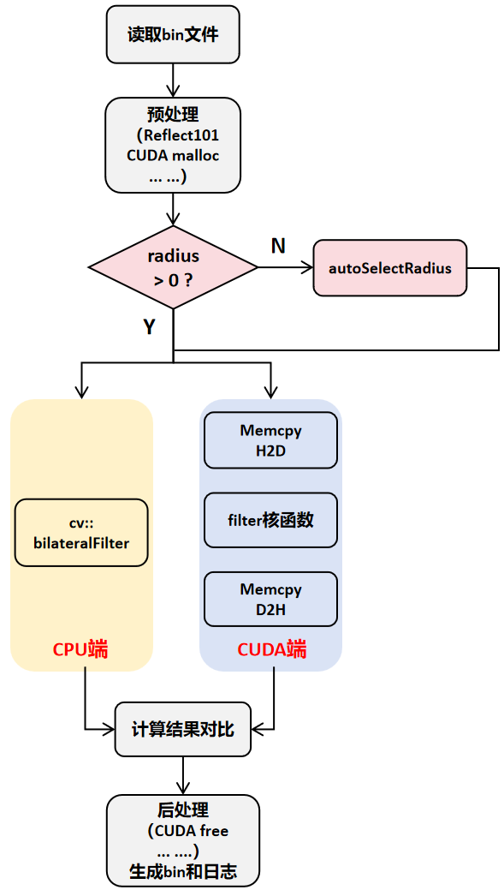 </div>


## 二.优化方法

### 2.1 <span id="target4">合适的并行计算策略</span>

​	对于输入尺寸为width * height的图像，设计过程中先后尝试了3种并行化方案：

- **方案1：每个线程（thread）处理一个滤波窗口**

​	设置 `blockDim = (16, 16), gridDim = (ceil(width/16), ceil(height/16))`；block沿x和y方向延申直至铺满整个待处理图像，block内部横向和纵向各16个thread，每个thread负责计算图像上以某点为中心区域的滤波结果（通过二重循环处理窗口内每一个像素）。

​	整体如下所示，其中蓝框标注为整个grid范围；红框标注为一个block范围（16 x 16），红圈代表一个thread；橙色标注为一个滤波窗口范围，同时代表一个thread的处理范围。

<div align="center">     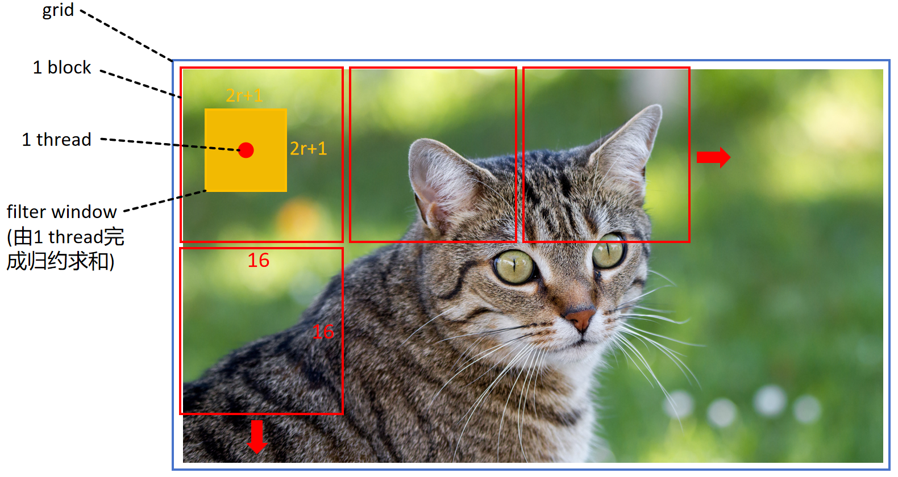 </div>


- **<span id="target5">方案2：每个线程束（warp）处理一个滤波窗口</span>**

​	在方案1中，每个线程需要对滤波窗口内每个像素点进行遍历，二重循环开销较大。考虑到双边滤波本质上是对数据的加权求和，因而可以考虑用一个线程束（warp）处理一个滤波窗口，并通过warp内寄存器级归约函数`__shfl_down_sync`完成最终的归约求和。

​	具体而言，设置 `blockDim = (32, 4, 4), gridDim = (ceil(width/4), ceil(height/4))`；block同样沿x和y方向延申至铺满整个待处理图像，block内部沿图像横向和纵向各4组thread，每组thread包含一个warp共32个子thread，每个warp负责计算图像上以某点为中心区域的滤波结果（此时warp内每个thread的工作量大幅减少，只需处理窗口内的个别像素点，并依赖最终的warp级归约得出最终结果）。

​	整体如下所示，其中蓝框标注为整个grid范围；红框标注为一个block范围（32 x 4 x 4）（的平面映射），红圈代表一个warp共32个thread；橙色标注为一个滤波窗口范围，每个橙圈代表warp内一个thread。相较方案1，此时每个thread只需处理 $(2r+1)^2/32$ 个像素点，工作量为原来的1/32；最后由warp内归约得到该warp所对应中心像素点的滤波结果。

<div align="center">     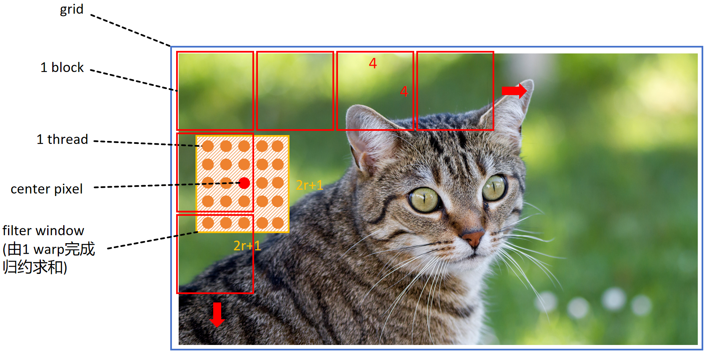 </div>


- **方案3：RGB通道级并行**

​	对于RGB图像，其具有三个通道，且每个通道计算流程完全相同，因此可以考虑在通道层面进行并行计算。具体而言，可以在方案1基础上修改 `gridDim = (ceil(width/16), ceil(height/4), 3)`，在不同的 `gridDim.z` 上处理不同颜色通道。

​	整体如下所示，除 `gridDim` 维度增加外，其余处理思路同方案1。

<div align="center">     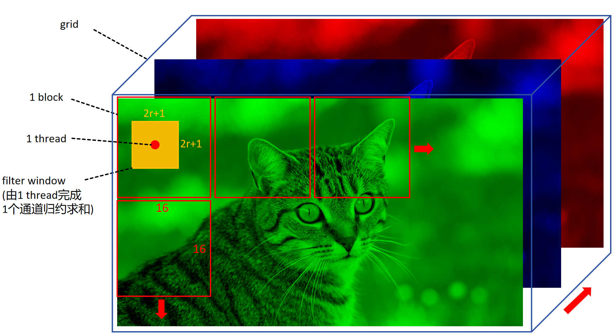 </div>


​	实验结果表明，在**常规滤波半径窗口下（~ 5）**，**方案1**效率最高。

​	**方案2** 虽然减少了单线程循环次数，但引入了频繁的寄存器级同步与`__shfl_down_sync`规约操作，在双边滤波这种计算密集型任务中，同步开销抵消了并行收益（尤其当滤波窗口半径较小时）；且方案2中block数量剧增（是方案1的16倍），从而导致硬件调度和指令分发开销随之增加，进一步消磨了高并行度所带来的理论收益。

​	**方案3** 虽然增加了通道并行度，却带来了访存带宽的冗余消耗。通道级并行导致相同坐标像素被R/G/B三个独立线程块（对应不同`gridDim.z`）分3次加载，相比方案1这种单次加载、线程内寄存器级复用、原地分离并处理RGB分量的高度集成模式，方案3降级为显存级重复加载，带来了不可忽略的冗余开销。


- **结论**

​	在 **常规半径** 下，**方案1**更好地实现了访存效率与并行度的平衡，是本设计中首选的计算策略。

​	但不可否认的是，随着滤波窗口半径增加（比如15 ~ 20的超大半径滤波），方案1的朴素双重循环开销会快速增加，此时可能需要探索更高效的并行策略，这也是后续优化探索的重要内容。


方案1的核心滤波函数`bilateralFilter`如下所示：

```cpp
//主体函数: 基于gpu的双边滤波, T = uint8_t / myPixel
template <typename T>
__global__ void bilateralFilter(T* src, T* dst, int radius, int width, int height, float sigma_spatial_sq, float sigma_color_sq){
    int x_dst = blockIdx.x * blockDim.x + threadIdx.x;//小图dst的x坐标
    int y_dst = blockIdx.y * blockDim.y + threadIdx.y;//小图dst的y坐标
    int x_src = x_dst + radius;//大图src的x坐标
    int y_src = y_dst + radius;//大图src的y坐标

    //一些宏定义, 计算常量和累加器
    int width_plus_radius = width + 2 * radius;
    #define SRC_AT(y, x)        src[(y) * width_plus_radius + (x)]
    #define DST_AT(y, x)        dst[(y) * width + (x)]
    float weight_sum = 0;
    float3 RGB_product_sum = make_float3(0.0f, 0.0f, 0.0f);
    float Gray_product_sum = 0.0f;


    //主要处理逻辑
    if(x_dst < width && y_dst < height){//如果在范围内才计算(考虑边界block里面的部分thread可能越界),注意是针对被生成对象(小图dst)而言
        T p = SRC_AT(y_src, x_src);//获取center_pixel
        for(int i = - radius; i <= radius; i += 1){//行
            int bound_j = sqrtf(radius * radius - i * i);//代替if(){continue}, 消除分支分歧; 
            for(int j = - bound_j; j <= bound_j; j += 1){//列
                int dist_sq = i * i + j * j;
                T q = SRC_AT(i + y_src, j + x_src);//获取neighbor pixel
                float diff_color = q - p;
                float w = __expf( - dist_sq / sigma_spatial_sq - diff_color * diff_color / sigma_color_sq);//这里合并后的直接计算性能显著高于查表
                weight_sum += w;
                if constexpr(std::is_same_v<T, myPixel>){//RGB
                    uint32_t q_val = *(uint32_t*)(&q);
                    RGB_product_sum.x += (q_val & 0xff) * w; 
                    RGB_product_sum.y += ((q_val >> 8) & 0xFF) * w; 
                    RGB_product_sum.z += ((q_val >> 16) & 0xFF) * w;
                }
                else{//灰度
                    Gray_product_sum += q * w;
                }
            }
        }

        float weight_inv = 1.0f / weight_sum;
        if constexpr(std::is_same_v<T, myPixel>){
            DST_AT(y_dst, x_dst) = myPixel(
                (uint8_t)__float2uint_rn(RGB_product_sum.x * weight_inv),
                (uint8_t)__float2uint_rn(RGB_product_sum.y * weight_inv),
                (uint8_t)__float2uint_rn(RGB_product_sum.z * weight_inv)
            );
        }
        else{
            DST_AT(y_dst, x_dst) = (uint8_t)__float2uint_rn(Gray_product_sum * weight_inv);
        }

    }
    
    #undef SRC_AT
    #undef DST_AT
}
```


### 2.2 对齐存储与向量化

- **基于显式对齐的结构体设计**

​	设计中为存储RGB图像多通道数据，引入了遵循 **4字节对齐** 准则的 `myPixel`类：除基础`_R`、`_G`、`_B`成员外，还包含冗余Alpha通道`_A`作为Padding，并使用`__align__(4)`关键字，强制使像素对象符合全局内存的对齐访问规范，有效避免跨缓存行访问，最大限度利用总线带宽：

```cpp
class __align__(4) myPixel{
private:
    uint8_t _R;
    uint8_t _G;
    uint8_t _B;
    uint8_t _A;
public:
	//other functions
}
```


- **访存合并与读取宽度优化**

​	对于RGB图像，双边滤波器会单独处理R、G、B通道，因此在主循环内，需逐次加载`myPixel`的`_R`、`_G`、`_B`成员。这通常会编译生成3次独立访存指令`LDG.E.U8`（加载8位无符号整型），带来更高的指令发射、访存延迟和流水线停顿代价。为避免这一问题，设计中将`myPixel`对象强制理解为`uint32_t`类型而仅进行1次访存`LDG.E.32`（加载32位整型），此后通过更高效的位运算（移位+掩码）进行`_R`、`_G`、`_B`成员拆分，用低成本运算代替高成本访存，实现了负载均衡：

```cpp
//核函数内
float3 RGB_product_sum = make_float3(0.0f, 0.0f, 0.0f);//全局累加器，对应R、G、B三个通道

//对于滤波窗口内每个点：
for(int i = -radis; i <= radius; ++i){
    for(int j = -radius; j <= radius; ++j){
        ...//进行权重w计算等
        T q = SRC_AT(i + y_src, j + x_src);//加载neighbor pixel
		uint32_t q_val = *(uint32_t*)(&q);//强制解释为uint32_t
		RGB_product_sum.x += (q_val & 0xff) * w;//获取R分量
    	RGB_product_sum.y += ((q_val >> 8) & 0xFF) * w;//G
    	RGB_product_sum.z += ((q_val >> 16) & 0xFF) * w;//B
        ...
    }
}
```


- **采用内联向量指令计算色彩距离**

​	如 **[1.1.1](#target6)** 中所述，OpenCV计算色彩域距离时采用了$L_{1}$范数，这恰好对应CUDA的向量指令`vabsdiff4`——其具备SIMD特点，能够在一个时钟周期内同时计算两组4字节数据（如`char4`或者这里定义的`myPixel`）对应分量的绝对差值。基于此，本设计为`myPixel`设计了如下减法重载函数，有效提升了$L_{1}$范数计算速度：

```cpp
__device__//注意vabsdiff4只适用于设备端
int myPixel::operator-(const myPixel& other) const {
    unsigned int p1, p2;
    p1 = *(unsigned int*)this; p2 = *(unsigned int*)&other;
          
    unsigned int result;
    asm("vabsdiff4.u32.u32.u32.add %0, %1, %2, %3;" : "=r"(result) : "r"(p1), "r"(p2), "r"(0));
    return result;
}
```

​	注：1. 理论上可以用功能相同的封装函数`__vabsdiff4u()`代替内联汇编指令，但不知为何在 **Nvidia** 平台，`__v*`等向量指令计算结果都存在问题，原因待进一步研究；

2. **Metax** 和 **Iluvatar** 平台暂不支持向量指令，只能采用传统计算方式：

```cpp
__host__ __device__
int myPixel::operator-(const myPixel& other) const{
    int r_d = (int)_R - (int)other._R;
    int g_d = (int)_G - (int)other._G;
    int b_d = (int)_B - (int)other._B;
    return abs(r_d) + abs(g_d) + abs(b_d);
}
```


- **总结**

​	采用上述对齐存储、高效加载和向量化运算等优化方法后（主要针对`myPixel`和RGB图），整体滤波速度能获得 **10% ~ 15%** 的提升。


### 2.3 <span id="target2">循环边界收缩</span>

​	如前所述，在OpenCV实现中，滤波窗口是半径为radius的圆而非矩形，因此在CUDA核函数的主循环中，需判断每个邻域点是否落在中心像素半径为radius的圆内：

```cpp
//核函数内,对于滤波窗口内每个点：
for(int i = -radis; i <= radius; ++i){
    for(int j = -radius; j <= radius; ++j){
       	if(i * i + j * j >= radius * radius){
            continue;//如果落在圆外，则直接跳过
        }
        ...
    }
}
```

​	但上述方案实际上会导致矩形四角处约$1- \frac{\pi}{4}≈21\%$的空转迭代，即便有`continue`语句也无法避免条件跳转与谓词掩码计算，从而增大了循环和分支预测开销。为此，设计中采用边界函数 $bound\_j = \sqrt{R^2 - i^2}$ 设置空域窗口遍历范围，替代了传统`if...continue`的逻辑判断：

```cpp
//核函数内,对于滤波窗口内每个可能点：
for(int i = -radis; i <= radius; ++i){
    //给出边界函数，代替if(){continue}，有效减少循环和分支语句
    int bound_j = sqrtf(radius * radius - i * i);
    for(int j = -bound_j; j <= bound_j; ++j){
        ...
    }
}
```

​	基于此，循环边界被主动收缩，消除隐式控制流分歧的同时减少了约$21\%$的无效指令发射，使得GPU的取指/译码单元能够保持更高的流水吞吐率，加速了滤波效率。虽然相比`if...continue`方案增加了`sqrtf`的浮点运算，但经测试，其对于控制流的优化收益远超算数指令成本。


- **总结**

  采用上述收缩循环边界的控制流优化方案后，整体滤波速度能获得 **25% ~ 30%** 的提升；


### 2.4 计算-访存权衡

- **用查表代替直接计算**

  ​	在 **[2.3](#target2)** 中，计算循环边界$bound\_j$时涉及到浮点运算`sqrtf`、存在一定时间成本，此时一个常用的优化方案是用查找表（Look-up Table，LUT）代替直接运算，即将预计算所得结果放于常量内存（`__const__`）内，需要计算时用数组索引访存以快速获取结果，如下所示：

  ```cpp
  //核函数外: 定义lut(最大支持radius = 5,仅作示例)
  __constant__ int dist_lut[6][6] = {
      {0, 0, 0, 0, 0, 0}, // radius = 0
      {1, 0, 0, 0, 0, 0}, // radius = 1
      {2, 1, 0, 0, 0, 0}, // radius = 2
      {3, 2, 2, 0, 0, 0}, // radius = 3
      {4, 3, 3, 2, 0, 0}, // radius = 4
      {5, 4, 4, 4, 3, 0}  // radius = 5
  };
  
  //核函数内:
  for(int i = -radis; i <= radius; ++i){
      int bound_j = dist_lut[radius][abs(i)];//用查表替代直接计算
      for(int j = -bound_j; j <= bound_j; ++j){
          ...
      }
  }
  ```

  ​	经测试，此处采用LUT后，滤波速度能进一步提升约 **5%** 。但考虑到LUT尺寸会随支持半径范围增大而显著增加，为接受任意滤波半径，最终设计中暂未采用LUT。（但对于半径受限场景，如限制 $radius \le 5$时，可以采用该方案）


- **查表并非总能提升效率**

​	在滤波循环内也会涉及到指数、平方等算数运算，一个自然的想法是将这些运算也用LUT代替，比如通过查表直接获取空域权重和色域权重：
$$
weight\_spatial = \exp\left( -\frac{\|x_i - x\|^2}{2\sigma_s^2} \right)\\
weight\_color = \exp\left( -\frac{\|I(x_i) - I(x)\|^2}{2\sigma_c^2} \right)
$$
相关实现如下：

```cpp
//核函数外: 定义spatial_lut和color_lut,后续在main函数内进行初始化
__constant__ float spatial_lut_data[6][6];
__constant__ float color_lut_data[768];

__device__ inline float spatial_lut(int delta_y, int delta_x){
    return spatial_lut_data[delta_y][delta_x];
}

__device__ inline float color_lut(int L1_diff){
    return color_lut_data[L1_diff];
}

//核函数内:
T p = SRC_AT(y_src, x_src);//center pixel
for(int i = -radis; i <= radius; ++i){
    int bound_j = sqrtf(radius * radius - i * i);
    for(int j = -bound_j; j <= bound_j; ++j){
        ...
        T q = SRC_AT(i + y_src, j + x_src);//neighbor pixel
		float weight_spatial = spatial_lut(abs(i), abs(j));//直接查表获取weight_spatial
        float weight_color = color_lut(abs(q - p));//直接查表获取weight_color
        float w = weight_spatial * weight_color;
    	...
    }
}
```

​	但实测结果表明，上述代码会使滤波效率降低 **30%** 左右。其原因在于，这里的LUT（尤其是`color_lut`）不具备warp一致性。具体而言，`color_lut`的索引取决于`diff_color`，而在本设计中，同一warp里的线程面对的是不同的邻域像素（滤波窗口），产生的`diff_color`（访存地址）几乎是随机分布的、极易产生Bank Conflict，从而导致访存序列化和常量内存控制器的阻塞。而之前的dist_lut却具备访存地址一致性：同一warp内线程执行到循环的某一步时，`i`的值是完全相同的；当warp内所有线程请求同一地址时，硬件可通过Broadcast机制进行高效访存，从而保证滤波效率。

​	除此之外，CUDA具备高效的指数运算内嵌函数（Intrinsic Function）`__expf`，其可以直接映射到硬件的SFU（Special Function Unit）上，具备极高的吞吐量；且直接运算可以通过$e^a \times e^b = e^{a+b}$ 将两次指数操作合并，而采用LUT则难以实现这种操作融合。总体而言，采用如下 **合并后的直接指数运算** 可以获得更高的滤波效率：
```cpp
//核函数内:
T p = SRC_AT(y_src, x_src);//center pixel
for(int i = -radis; i <= radius; ++i){
    int bound_j = sqrtf(radius * radius - i * i);
    for(int j = -bound_j; j <= bound_j; ++j){
        ...
        T q = SRC_AT(i + y_src, j + x_src);//获取neighbor_pixel
        float diff_color = q - p;
        //为避免平方运算, sigma_spatial_sq = 2 * sigma_spatial * spatial直接作为函数入口参数; sigma_color_sq同理
        float w = __expf( - dist_sq / sigma_spatial_sq - diff_color * diff_color / sigma_color_sq);
    	...
    }
}
```


- **总结**

  ​	在核函数内，通过合理权衡访存（LUT）和运算操作，如在地址一致无冲突时用查表代替浮点运算、在存在Bank Conflict时利用高效内嵌函数直接运算，可以将整体滤波效率提升约 **30%**；


### 2.5 高效内存分配与异步传输

​	CUDA滤波的另一大开销在于内存分配和数据在D&H（Device & Host）间搬运，可针对二者分别进行优化。

- **锁页内存登记**

​	通常在Host端用`new`分配内存时，所得内存为 **可分页内存（Pageable Memory）**，其在传输前需要由驱动程序先拷贝至内部临时缓冲区，带来一定的时间开销。而 **锁页内存（Pinned Memory）**则允许DMA控制器直接访问Host内存，消除这一隐式拷贝。具体而言，可以通过`cudaHostRegister`将已分配的Host内存手动提升为锁页内存（并在结束后配合`cudaHostUnregister`进行释放），确立DMA直接访问路径，显著提升PCIe总线的有效吞吐量：

```cpp
//以RGB图为例,分配Host端内存
myPixel* h_src = nullptr, *h_dst = new Type[width * height];

//将Host端内存提升为锁页内存
cudaHostRegister(h_src, src_size, cudaHostRegisterDefault);
cudaHostRegister(h_dst, dst_size, cudaHostRegisterDefault);

//以下进行H2D拷贝、核函数启动、D2H拷贝等
myPixel *d_src, *d_dst;
...
    
//核函数运行完毕后,进行锁页内存释放
cudaHostUnregister(h_src);
cudaHostUnregister(h_dst);
```


- **异步数据传输**

  ​	传统D2H和H2D内存拷贝需调用`cudaMemcpy`函数，而这是 **阻塞操作** ，会妨碍主机端指令流的后续执行，导致 CPU 必须空等数据搬运完成，引发 CPU - GPU 间的协同失步；取而代之，使用`cudaMemcpyAsync`配合cuda流类型`cudaStream_t`可以实现数据拷贝事件的 **非阻塞分发**，即向接收端提交传输任务后立刻返回、不等待传输完成。这允许发送方继续执行后续的逻辑调度，最大程度实现传输与计算重叠，从而提升滤波效率。异步封装后核函数如下所示（注意`stream`作为了函数入口参数；在调用时需首先通过`cudaStreamCreate`创建`cudaStream_t stream`并传入）：

  ```cpp
  template <typename T>
  void runFilterPure(const T* h_src, T* d_src, T* d_dst, T* h_dst, int radius, int width, int height, float sigma_spatial_sq, float sigma_color_sq, size_t src_size, size_t dst_size, cudaStream_t stream){
      if(h_src == nullptr){
          return;
      }
  
      //H2D异步数据拷贝
      RUNTIME_CHECK(cudaMemcpyAsync(d_src, h_src, src_size, cudaMemcpyHostToDevice, stream));
  
      //启动核函数
      dim3 block_dim(16, 16);//blockDim固定为32 x 32
      dim3 grid_dim((width + 15) / 16, (height + 15) / 16);//gridDim根据img尺寸适配
      bilateralFilter<T><<<grid_dim, block_dim, 0, stream>>>(d_src, d_dst, radius, width, height, sigma_spatial_sq, sigma_color_sq);
  
      //D2H异步数据拷贝
      RUNTIME_CHECK(cudaMemcpyAsync(h_dst, d_dst, dst_size, cudaMemcpyDeviceToHost, stream));
  
      cudaStreamSynchronize(stream);
  }
  ```

  ​	更重要的是，这种异步传输方式为 **多流（Multi-Streaming）**并行提供了基础，有望在处理视频时实现“传输N+1帧的同时计算第N帧”，让预处理、数据搬运和GPU端运算充分流水，最大程度提升效率；这也是后续的重要改进方向。

  

- **总结**

  ​	通过上述高效内存分配和数据传输机制，可以将整体效率提升 **15% ~ 20%**；


### 2.6 尝试过但未采用的优化手段

#### 2.6.1 <span id="target3">共享内存</span>

​	为进一步提升访存效率，设计中尝试先将像素值加载至共享内存（Shared Memory），后续在核函数内直接访问SM以快速获取数据。具体而言，在进入核函数`bilateralFilter`后，由一个block（16 x 16）协作加载所有可能被处理的像素点（由若干滤波窗口交叠而成），如下所示：

```cpp
//核函数内:
constexpr size_t SMEM_SIZE = 32;//16 + 2 * 8, 最大支持半径可达8 (仅作示例)
__shared__ char s_buffer[32 * 32 * sizeof(T)];
T* neighbors = (T*)s_buffer;
//cooperative load, 每个block内线程一起完成(16 + 2r) * (16 + 2r)区域像素点的加载
for(int i = ty; i < SMEM_SIZE; i += blockDim.y){//行
    for(int j = tx; j < SMEM_SIZE; j += blockDim.x){//列
        int x_cur = blockIdx.x * blockDim.x + j;
        int y_cur = blockIdx.y * blockDim.y + i;
        if(x_cur < (width + 2 * radius) && y_cur < (height + 2 * radius)){
            neighbors[i * 32 + j] = SRC_AT(y_cur, x_cur);
    	}
    }
}
__syncthreads();

//后续对于该block内每个thread, 访问neighbor pixel可以由SRC_AT改为访问s_buffer
```

​	但测试结果表明，上述引入共享内存的方案并未达到预期加速效果，甚至在中小滤波半径场景下效率明显降低，可能原因在于：双边滤波本身为计算密集型应用，每个像素对于一个线程而言只会被访问一次，因而填充SM所带来的固有消耗需要在滤波半径足够大时才会被抵消；共享内存填充/访问时需进行额外的坐标变换与索引计算，一定程度上增加了ALU的负担；此外`__syncthreads()`所带来的强制块内线程同步也会造成流水线停顿。

​	综合考虑，本设计最终未采用Shared Memory进行数据加载；在未来探索中，尤其面对大/超大半径滤波时，Shared Memory可能将成为更适合的选择。


#### 2.6.2 向量化加载

​	具体参见 **四.Ncu分析：**[**相关优化尝试**](#target1)。


## 三. 性能指标分析

### 3.0 总览

​	本设计在 **Nvidia（英伟达）**、**Moore（摩尔线程）**、**Metax（沐曦）**、**Iluvatar（天数）**平台上均能实现以下功能：

- 支持 **任意尺寸** 的灰度或RGB图像（.bin）输入；
- 支持 **任意半径** 配置，且当radius <= 0时根据输入图像特征 **自适应选取半径** ；
- 支持 **任意sigma_spatial和sigma_color** 配置；


​	在上述四大平台，基于**4K UHD（3840 * 2160）图像测试集（Gray/RGB）**，本设计可达到以下性能：

- **计算精度：**和OpenCV的bilateralFilter标杆实现相比，各平台计算误差**MAE均小于1**，符合要求
  - **RGB图像：**全部测试半径下，**MAE <= 1e-5**；
  - **Gray图像：**当测试半径 > 2时，**MAE <= 1e-5**；当半径 <= 2时，可能由于算法差异，**MAE ≈ 0.5**；

 - **吞吐量与加速比：**
   - **Nvidia平台：**峰值吞吐量 **3254.41MP/s (Gray)** 和 **1650.54MP/s (RGB)**，峰值加速比 **4.27553x (Gray)** 和 **17.9033x (RGB)** 
   - **Moore平台：**峰值吞吐量 **12522.78MP/s (Gray)** 和 **4833.82MP/s (RGB)**，峰值加速比 **11.8315x (Gray)** 和 **30.1175x (RGB)** 
   - **Metax平台：**峰值吞吐量 **9551.09MP/s (Gray)** 和 **4361.43MP/s (RGB)**，峰值加速比 **2.80345x  (Gray)** 和 **21.1496x (RGB)** 
   - **Iluvatar平台：**峰值吞吐量 **8594.56MP/s (Gray)** 和 **2662.75MP/s (RGB)**，峰值加速比 **8.35226x (Gray)** 和 **11.4367x (RGB)** 


### 3.1 误差

​	基于4K UHD图像测试集，取sigma_spatial = 3.0，sigma_color = 30.0，各平台误差分析如下：


#### 3.1.1 Nvidia

​	在Nvidia平台上（A100），各测试半径下典型计算误差（MAE）如下表所示：

| 滤波半径 |    Gray     |     RGB     |
| :------: | :---------: | :---------: |
|    1     | *0.481447*  | 8.43943e-07 |
|    2     | *0.499052*  | 8.31887e-06 |
|    3     | 4.5814e-06  | 3.73746e-06 |
|    4     | 2.65239e-06 | 2.93371e-06 |
|    5     | 2.77296e-06 | 5.14403e-06 |
|    6     | 5.66647e-06 | 7.31417e-06 |
|    7     | 7.71605e-06 | 4.58140e-06 |
|    8     | 8.07774e-06 | 9.16281e-06 |
|    9     | 5.30478e-06 | 7.15342e-06 |
|    10    | 7.35436e-06 | 6.91229e-06 |

​	除小半径Gray图外，MAE均不超过1e-5；


#### 3.1.2 Moore

​	在Moore平台上（S5000），各测试半径下典型计算误差（MAE）如下表所示：

| 滤波半径 |    Gray     |     RGB     |
| :------: | :---------: | :---------: |
|    1     | *0.493864*  | 2.57202e-6  |
|    2     |  0.497564   | 2.41450e-6  |
|    3     | 4.46084e-6  | 5.70666e-6  |
|    4     | 8.80112e-06 | 5.14403e-06 |
|    5     | 7.47492e-06 | 4.5814e-06  |
|    6     | 5.42535e-06 | 5.14403e-06 |
|    7     | 6.51042e-06 | 6.59079e-06 |
|    8     | 6.02816e-06 | 3.77765e-06 |
|    9     | 6.02816e-06 | 5.30478e-06 |
|    10    | 3.49633e-06 | 3.17483e-06 |

​	除小半径Gray图外，MAE均不超过1e-5；


#### 3.1.3 Metax

​	在Metax平台上（C500），各测试半径下典型计算误差（MAE）如下表所示：

| 滤波半径 |    Gray     |     RGB     |
| :------: | :---------: | :---------: |
|    1     | *0.486975*  | 1.24582e-06 |
|    2     |  *0.49526*  | 8.23849e-06 |
|    3     | 4.94309e-06 | 5.94779e-06 |
|    4     | 7.11323e-06 | 3.73746e-06 |
|    5     | 6.51042e-06 | 6.95248e-06 |
|    6     | 6.14873e-06 | 5.66647e-06 |
|    7     | 7.95718e-06 | 6.10854e-06 |
|    8     | 4.21971e-06 | 7.03286e-06 |
|    9     | 4.94309e-06 | 4.74216e-06 |
|    10    | 6.63098e-06 | 4.34028e-06 |

​	除小半径Gray图外，MAE均不超过1e-5；


#### 3.1.4 Iluvatar

​	在Iluvatar平台上（BI100），各测试半径下典型计算误差（MAE）如下表所示：

| 滤波半径 |    Gray     |     RGB     |
| :------: | :---------: | :---------: |
|    1     | 1.68789e-06 | 4.42065e-07 |
|    2     | 6.51042e-06 | 2.81314e-06 |
|    3     | 2.53183e-06 | 4.38047e-06 |
|    4     | 4.09915e-06 | 4.58140e-06 |
|    5     | 3.01408e-06 | 4.38047e-06 |
|    6     | 7.23380e-06 | 2.57202e-06 |
|    7     | 6.51042e-06 | 3.49633e-06 |
|    8     | 9.88619e-06 | 5.94779e-06 |
|    9     | 6.99267e-06 | 4.25990e-06 |
|    10    | 7.11323e-06 | 5.10385e-06 |


### 3.2 吞吐量

​	基于4K UHD图像测试集，各平台吞吐量分析如下；其中用红线标注出了**4K fps**所对应的吞吐量（~ 497.7 MP/s）:


#### 3.2.1 Nvidia

<div align="center">     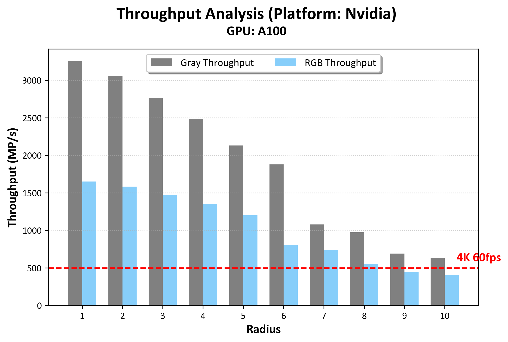 </div>  	

​	由图可知，吞吐量随滤波半径的增长而明显下降，从Radius = 1时的峰值 **3254.41MP/s (Gray)** 和 **1650.54MP/s (RGB)**  逐步滑落到Radius = 10的最低值 **632.35MP/s (Gray)** 和 **405.94MP/s (RGB)**；

​	由于通道数不同，灰度图的吞吐量维持在RGB图的**1.5x ~ 2x**左右；

​	当**Radius <= 8**时，本设计的吞吐量可以达到4K UHD 60fps的工业级标准；


#### 3.2.2 Moore

<div align="center">     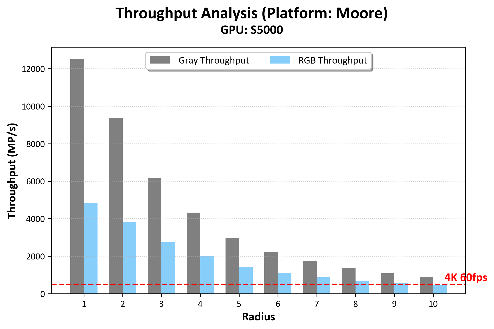 </div>	

​	类似Nvidia平台，吞吐量随滤波半径增长而显著下降，从Radius = 1时的峰值 **12522.78MP/s (Gray)** 和 **4833.82MP/s (RGB)**  逐步滑落到Radius = 10的最低值 **885.31MP/s (Gray)** 和 **453.54MP/s (RGB)**；

​	灰度图的吞吐量维持在RGB图的**2x ~ 3x**左右；

​	此外，**Moore平台的吞吐量整体都高于Nvidia，平均提升可达1.5x（四个平台中最高）**；相应地，当**Radius <= 9**时，吞吐量均可达到4K 60fps标准；


#### 3.2.3 Metax

<div align="center">     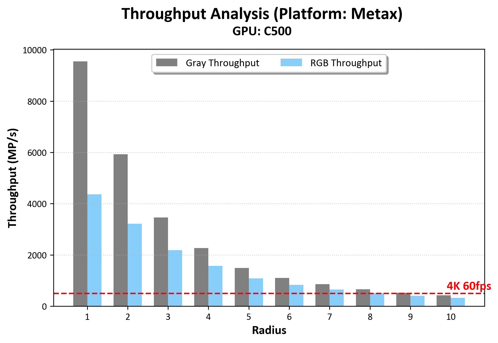 </div>		

​	类似前述平台，吞吐量随滤波半径增长而显著下降，从Radius = 1时的峰值 **9551.09MP/s (Gray)** 和 **4361.43MP/s (RGB)**  逐步滑落到Radius = 10的最低值 **425.89MP/s (Gray)** 和 **330.19MP/s (RGB)**；

​	灰度图的吞吐量维持在RGB图的**1.1x ~ 2x**左右；

​	整体而言，Metax平台的吞吐量介于Nvidia和Moore之间；当**Radius <= 8**时，吞吐量可达到4K 60fps标准；


#### 3.2.4 Iluvatar

<div align="center">     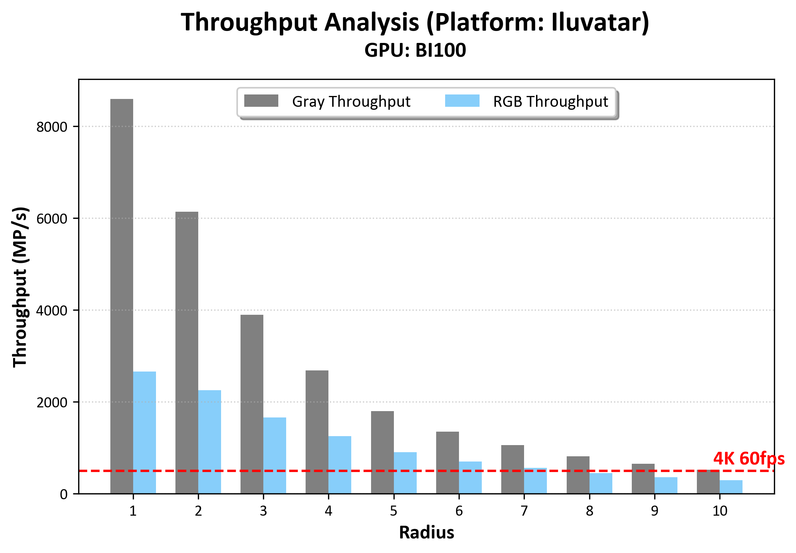 </div>

​	吞吐量同样随滤波半径增长而显著下降，从Radius = 1时的峰值 **8594.56MP/s (Gray)** 和 **2662.75MP/s (RGB)**  逐步滑落到Radius = 10的最低值 **523.72MP/s (Gray)** 和 **291.72MP/s (RGB)**；

​	灰度图的吞吐量维持在RGB图的**1.5x ~ 3.5x**左右；

​	Iluvatar平台的吞吐量接近但略低于Metax；当**Radius <= 7**时，吞吐量可达到4K 60fps标准；


#### 3.2.5 对比与总结

​	基于RGB图片，选取几个典型半径，横向对比四大平台的吞吐量，结果如下图所示：

<div align="center">     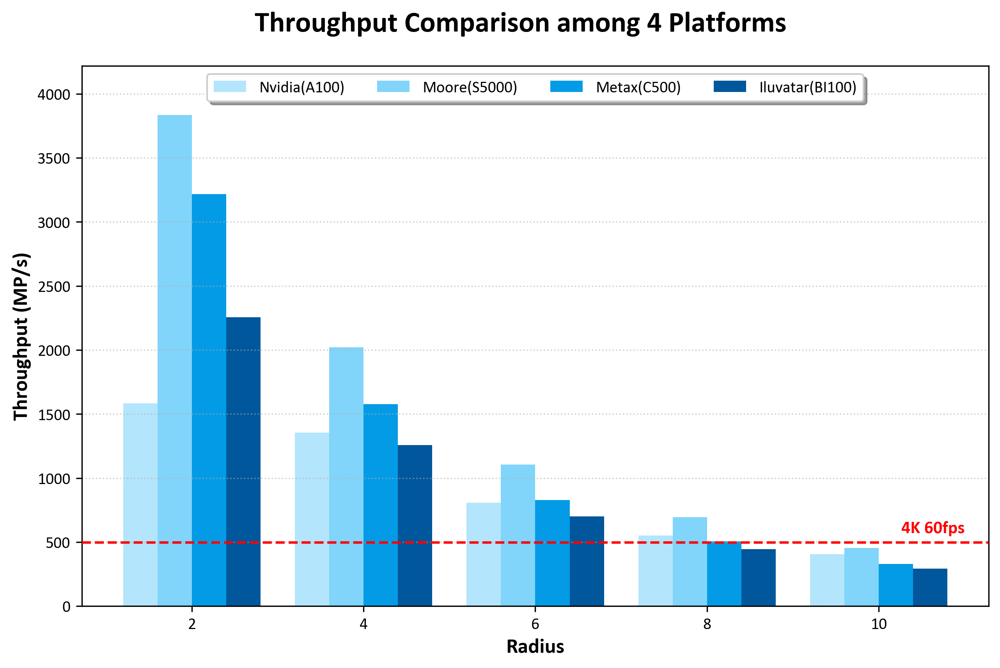 </div>

​	结论：

- **三大国产平台是小半径滤波的首选：**

​	在**小半径(Radius <= 2)**下，**三大国产平台** 展现出较强的吞吐量优势，性能可达 **Nvidia** 的 **1.5x ~ 2x** 。这表明国产GPU架构在处理中低复杂度的并行任务时，具备更优的指令发射效率或内存带宽利用率，是轻量级实时滤波的首选；

- **性能随计算强度增加而衰减的特性：**

​	随滤波半径增加，所有平台的吞吐量受限于$O(N^2)$计算复杂度而下降，但 **三大国产平台** 降幅更为显著。这反映出在极限计算负载下，国产硬件架构在资源调度、执行效率等方面面临更大挑战；相较而言 **Nvidia** 则更为稳健；

- **Nvidia平台是大规模滤波的首选：**

​	在**大半径(Radius >= 10)**下，**Nvidia** 平台凭借更强的鲁棒性，吞吐量最终反超多数国产平台。对于追求大规模窗口的高质量图像处理场景，**Nvidia** 具有更高的性能下限保障。


### 3.3 加速比

​	基于4K UHD图像测试集，各平台加速比（GPU吞吐量 / CPU基于openCV吞吐量）分析如下：


#### 3.3.1 Nvidia

<div align="center">     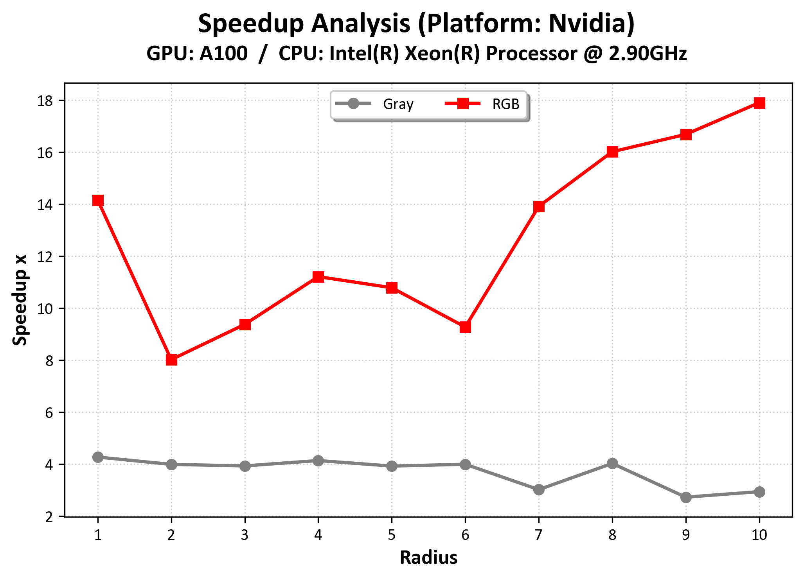 </div>

​	基于**Nvidia A100 GPU **和 **Intel(R) Xeon(R) Xeon(R) Processor @ 2.90GHz CPU**：

- 对于Gray图，加速比稳定在 **3x ~ 4x** 左右；
- 对于RGB图，加速比分布在 **8x ~ 18x** 左右，随滤波半径变化而波动较大，但后期呈上升趋势；


#### 3.3.2 Moore

<div align="center">     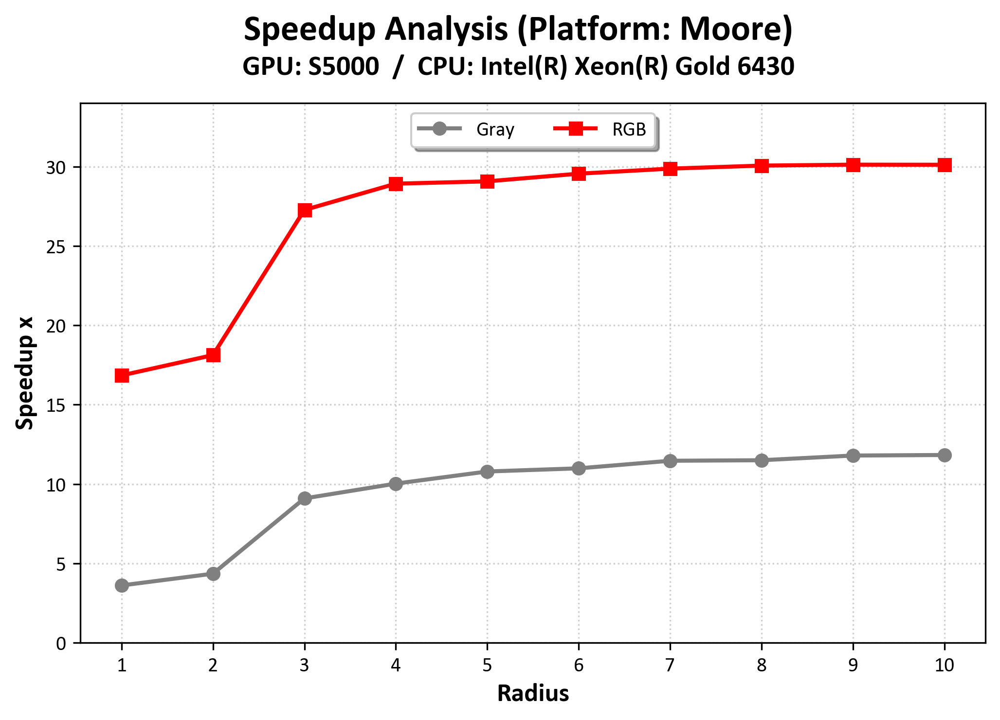 </div>

​	基于 **Moore S5000 GPU** 和 **Intel(R) Xeon(R) Gold 6430 CPU**：

- 对于Gray图，加速比分布在 **4x ~ 12x** 左右，随半径增大而逐渐上升；
- 对于RGB图，加速比分布在 **17x ~ 30x** 左右，同样随半径增大而逐渐上升；


#### 3.3.3 Metax

<div align="center">     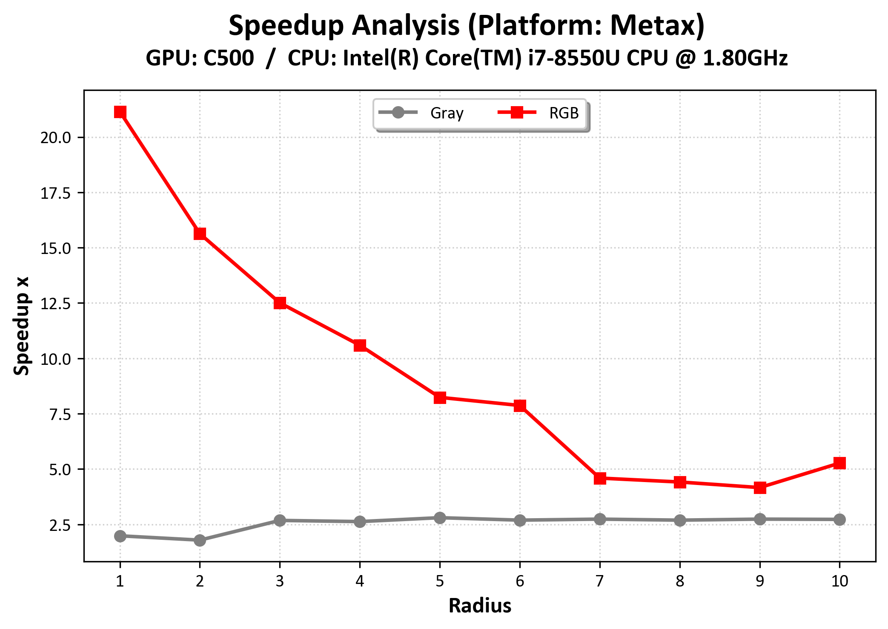 </div>

​	基于 **Metax C500 GPU** 和 **Intel(R) Core(TM) i7-8550U @ 1.80GHz CPU**：

- 对于Gray图，加速比稳定在 **2.5x** 左右；
- 对于RGB图，加速比分布在 **21x ~ 4x** 左右，随半径增大而显著下降；


#### 3.3.4 Iluvatar

<div align="center">     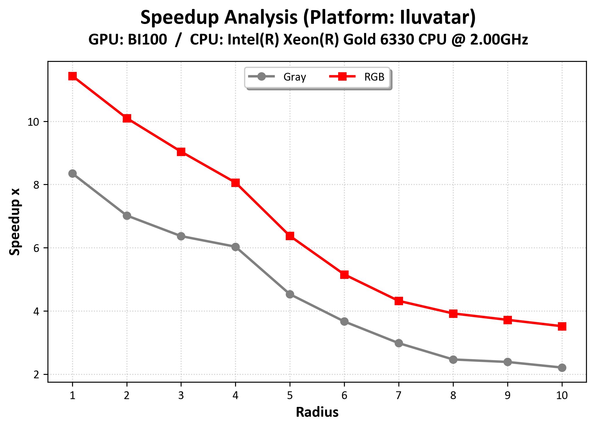 </div>

​	基于 **Iluvatar BI100 GPU** 和 **Intel(R) Xeon(R) Gold 6330 @ 2.00GHz CPU**：

- 对于Gray图，加速比分布在 **2x ~ 8x** 左右，随半径增大而显著下降；
- 对于RGB图，加速比分布在 **4x ~ 11x** 左右，同样随半径增大而显著下降；


#### 3.3.5 对比与总结

​	通过对各平台加速比的分析，可以得出以下结论：

- **计算密集度与加速效率成正相关性：**

​	全平台RGB图的加速比普遍高于Gray图（如 **Moore** 平台RGB加速比可高达30x，而Gray仅为12x）。这证明GPU大规模并行计算单元的算力优势在处理多通道、高计算密度的任务时更加显著，符合GPU的硬件特性，也验证了设计的有效性；

- **不同平台对于大半径计算的抗压能力各异：**

​	**Nvidia** 和 **Moore** 平台的加速比随半径增大呈上升或平稳趋势，展现了相应GPU硬件优秀的缓存命中率和寄存器压力管理，适合大半径、超大半径处理场景。相比之下，**Metax** 和 **Iluvatar** 平台在半径增大时加速比出现显著下滑，反映了在大尺寸窗口下，局部访存与计算特征的变化对部分国产GPU架构的处理效率提出了较大的挑战；

- **加速比根据基准的不同存在相对性：**

​	上述加速比数据仅供参考，无法作为各平台GPU性能的绝对指标，因为其数值受宿主CPU性能基准影响显著。例如 **Metax** 平台的对比基准为低功耗嵌入式/网络服务器CPU Core(TM) i7-8550U ，性能和其他三个平台的Xeon系列CPU存在明显差距，因此加速比可能存在虚高现象。


## 四. Ncu分析

​	由于服务器启用ncu需要sudo权限，因此只在本地（Nvidia GeForce RTX 5090 Laptop GPU）对相同代码进行ncu分析，结果如下：

- **radius = 8，RGB图**

  总览：

  <div align="center">     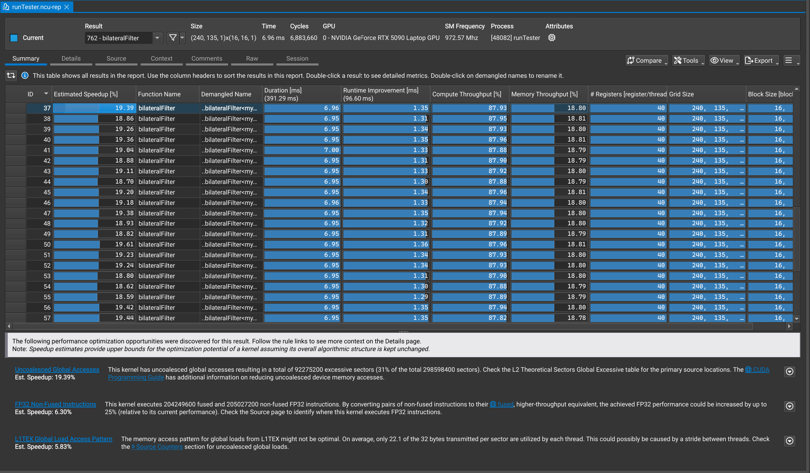 </div>

​	汇编细节：

<div align="center">     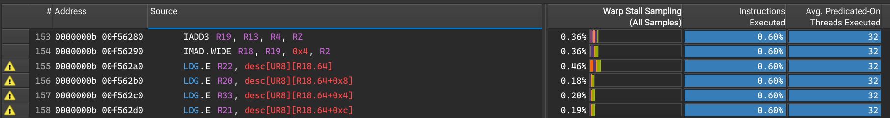 </div>


<div align="center">     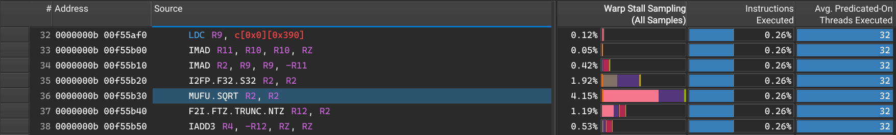 </div>


​	由总览可知，主要待优化点在于 **非合并的全局访存**（Uncoalesced Global Access），总预期提速效果约 **19.39%**；根据汇编结果，这一瓶颈来自于代码中短字节加载指令如`LDG.E Rxx`等，而其产生根本原因在于：myPixel为4 byte结构体，而GPU硬件最多可以一次性加载16 byte；为最大限度利用带宽，编译器尝试将内层循环进行步长为4的展开、以期一次性加载更多数据（如利用`LDG.E.128`一次加载4 x 4 byte = 16 byte）以便批量处理，但实际核函数内循环的处理逻辑是针对单一像素点进行的，因此`LDG.E.128`的尝试失败了，回滚到4次分立的普通加载`LDG.E`， 也就未能最大程度利用访存带宽。

​	此外根据汇编结果，`MUFU.SQRT`指令前后存在较多warp stalling，这是因为在进行循环边界 $bound\_j$ 计算时涉及开方运算，其时间成本较高、对相关硬件单元的占用导致了线程阻塞。该问题可以通过 **[2.3](#target2)** 中所述LUT方案解决，但考虑到需支持任意滤波半径，为避免LUT过大，最终还是采用了直接开方计算。


- **radius = 8，Gray图**

  总览：

  <div align="center">     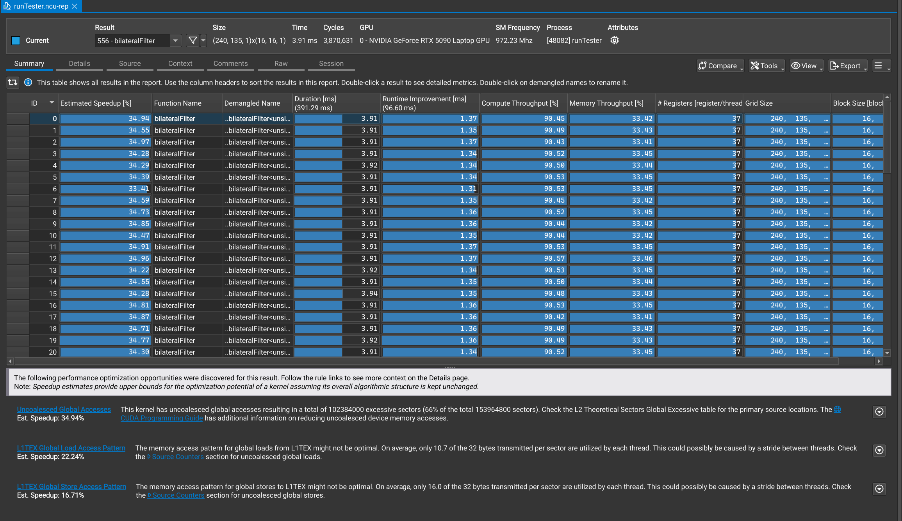 </div>

​	汇编细节：

<div align="center">     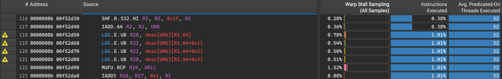 </div>


<div align="center">     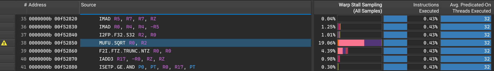 </div>


​	和RGB图像一样，主要待优化点仍在于 **非合并的全局访存**（Uncoalesced Global Access），预期提速效果约 **34.94%**；此外指出的待优化点 **L1 缓存/纹理缓存全局加载/存储访问模式** （L1TEX Global Load/Store Access Pattern）也和非合并访存相关，预期提速效果分别约 **22.24%** 和 **16.71%**。这里主要原因同上，在于汇编生成了一系列分立的短字节加载指令如`LDG.E.U8`等，而未能利用更高效的向量化加载；由于Gray图每个像素只占用1 byte且核函数循环针对单一像素点进行，因此访存总线带宽相较RGB图而言更低、预期提速更高。

​	此外同RGB图，`MUFU.SQRT`也带来了较大的warp stalling，其原因和解决方法不再赘述。


​	由于ncu指出的待优化点主要集中在访存，因而当滤波半径减小、计算密度降低而访存占比增大时，相关问题会更显著。实际结果也印证了这一点：


- **radius = 5，RGB图**

  <div align="center">     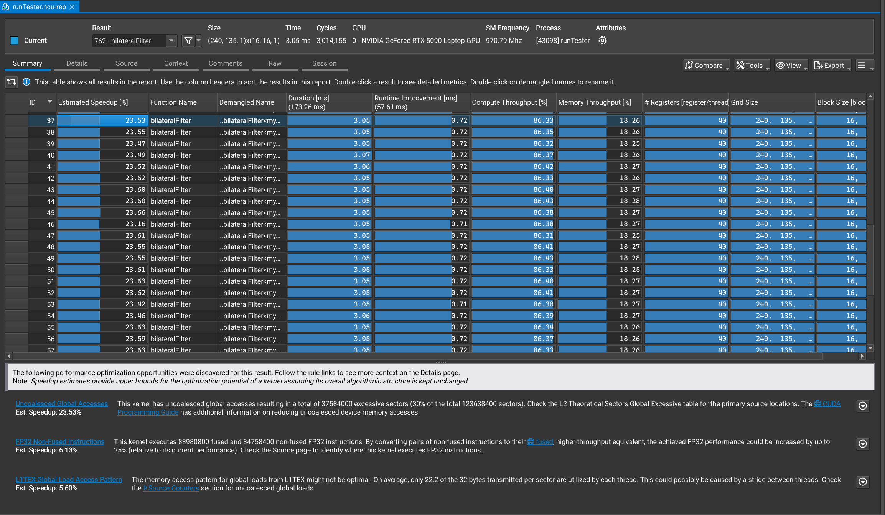 </div>

​	和预期一样，此时解决非合并访存所带来的理论优化效果有所提升，达到了 **23.53%**；


- **radius = 5，Gray图**

  <div align="center">     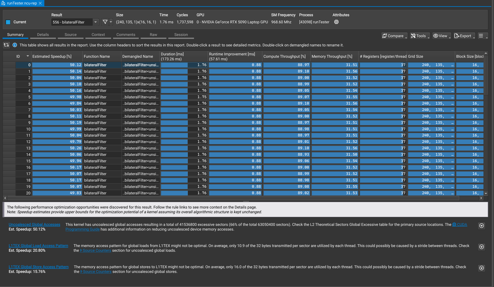 </div>

​	理论提速达到了 **50.12%**；


- **<span id="target1">相关优化尝试</span>**

​	为解决非合并访存带来的弊端，本设计尝试了向量加载。具体而言，对于RGB图，每次循环中，每个线程以uint4（大小等于4个myPixel）一次性加载4个像素点并批量处理；对于Gray图，每次循环中，每个线程以uchar4（大小等于4个uint8_t）同样一次性加载4个像素点并批量处理。

​	但实际测试结果表明，在常规半径下，该方案反而会导致效率下降 **15% - 20%**，如下图所示（radius = 5，Gray）：

<div align="center">     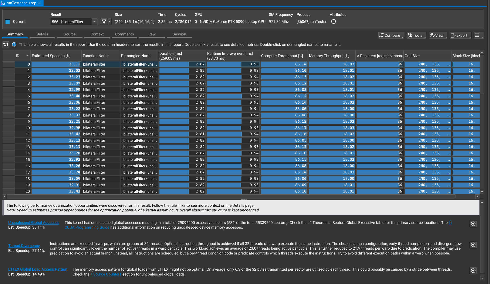 </div>

​	不可否认，该方案确实一定程度上优化了非合并访存（理论提速从 **50.12%** 降为 **33.11%**），却带来了更为严重的 **线程分歧**（Thread Divergence）问题。原因在于，uchar4/uint4的向量化加载必须以数据4 byte/16 byte对齐为前提，而对于整张图像而言，有3/4的像素是不满足这一要求的，因此核函数需针对这些线程设置额外的逻辑以处理非对齐的头尾像素。这就导致了该3/4线程和剩余的1/4线程在循环内无法实现完美同步——1/4线程跳过了非对齐处理逻辑、空转等待剩余的3/4线程，进而引发分歧。

​	权衡利弊后，当前设计暂未采用向量化加载方案，继续沿用朴素的循环处理每个像素。


## 五.未来工作

### 5.1 超大半径滤波下的并行计算策略选择

​	如 **[2.1](#target4)** 所述，当前设计采用了“一个线程处理一个滤波窗口”的计算策略，本质上是双重循环；虽然在常规滤波半径下该方案速度尚可，但随着滤波半径增大，$O(N^2)$的计算复杂度必然会成为效率瓶颈。为解决这一问题，未来可以尝试在 **算法层面**（如采用近似计算、间隔计算、下采样、快速可分离双边滤波等）降低计算并行度、减少循环次数，或在 **硬件调度层面**（如采用2.1中**[方案2](#target5)** 的warp级归约）提升并行度、减少循环层数。


### 5.2 实时视频处理

​	当前设计仅针对静态图片进行双边滤波，且异步数据加载仅启用单流。在未来，可以考虑将本设计拓展为基于实时视频（4K，60fps）的动态双边滤波，采用异步多流、双缓冲池、低精度（fp16）/混合精度（fp16 + fp32）计算等优化手段实现端到端的高效数据处理。


### 5.3 继续尝试利用共享内存

​	虽然本设计尝试利用Shared Memory却没带来效率提升（**[2.6.1](#target3)**），但后续将在更复杂应用场景下（如超大半径滤波）继续挖掘共享内存的潜能，或尝试不一样的加载策略。


### 5.4 继续尝试向量指令与向量加载

​	本设计通过向量指令`vabsdiff4`有效加速了色域$L_{1}$范数的计算，未来可以考虑在设计中融入更多SIMD的向量指令（同时尝试解决一系列封装后的向量函数`__v*`在Nvidia等平台计算行为异常的问题）。	

​	此外后续将继续探索高效的向量加载方案（尤其在超大半径滤波场景下），尝试克服现存的由字节对齐导致的线程分歧问题。

​	

### 5.5 消除小半径下和OpenCV存在的系统误差

​	如前所述，当前设计在处理小滤波半径（radius <= 2）的灰度图时，在大多数平台上都和OpenCV标杆实现存在0.5左右的MAE，具体原因有待进一步分析。
